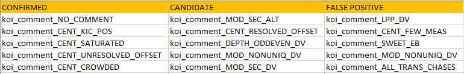

# Study of Exoplanets

## Abstract
Our study conducts a data analysis on around 10,000 exoplanet candidates from NASA’s Kepler mission, focusing on their classification, habitability, and the impact of observational and stellar parameters. We explored three main questions: the influence of observational parameters on classification, the habitability of Earth-size planets around different stars, and the correlations between disposition values and flag variables. Using models like GLMM (96.98% accuracy), Random Forest, and KNN, we identified key predictors for planet classification including planetary radius and stellar effective temperature. Our findings reveal only a small fraction of exoplanets could potentially harbor liquid water, with habitability closely linked to star metallicity and planet composition. Additionally, we found significant correlations between disposition scores, commentary, and flag variables, highlighting the challenge of false positives in exoplanet detection. This research enhances our understanding of exoplanetary systems and guides future astronomical endeavors.

## Keywords
Exoplanets, generalized linear/additive mixed models, parametric modeling, non-parametric modeling.

## Introduction
The Kepler Space Telescope, a pioneering mission initiated by NASA in 2009, has significantly advanced our understanding of exoplanets orbiting stars beyond the Solar System. Its primary mission was to survey a portion of our galaxy to discover Earth-size and smaller planets in or near the habitable zone and determine how many of the billions of stars in the Milky Way have such planets. By May 2016, Kepler’s observations and analyses had led to the verification of 1,284 new exoplanets, marking a significant contribution to the broader field of astrophysics and expanding our knowledge of planetary systems. As of October 2017, the cumulative tally of confirmed exoplanets exceeded 3,000, illustrating the vastness of our galaxy’s planetary diversity and the effectiveness of Kepler’s observational capabilities.

## Data Description
The Kepler Exoplanet Dataset, a robust compilation of astrophysical data, encompasses observations of 9,564 celestial bodies suspected to be exoplanets. It features a rich array of 50 distinct attributes for each candidate, which includes identifiers like the Kepler ID (KepID) and Kepler Object of Interest Name (KOI Name). Additionally, the dataset provides a wealth of stellar characteristics, such as effective temperature, along with transit properties such as duration and depth that are crucial for understanding these distant worlds. The central focus of our research is the Exoplanet Archive Disposition (labeled as koi_disposition in the dataset), which classifies each observed object in terms of its candidacy as an exoplanet, based on a set of criteria that includes observational data and validated models. This variable is pivotal for distinguishing between confirmed exoplanets, false positives, and other categories, thereby facilitating a structured approach to exoplanetary studies.

## Data Cleaning
Our research involved meticulous data cleaning to ensure the integrity and usability of the Kepler Exoplanet Dataset. This process included filtering out rows with ‘CANDIDATE’ status in the koi_disposition variable, refining this variable into a categorical factor with distinct levels for ‘CONFIRMED’ and ‘FALSE POSITIVE’ statuses, and eliminating incomplete records. We also streamlined the dataset by removing columns not pertinent to our analysis objectives, such as kepoi_name, koi_comment, koi_vet_stat, and koi_pdisposition. Also, the removal of the koi_score column was the final step in preparing the dataset for in-depth exploration and analysis.

## Research Questions
1. **RQ1**: How do the various observational parameters of Kepler Objects of Interest (KOIs) influence their classification as actual planets?
   - Impact of stellar parameters such as effective temperature and metallicity.
   - Impact of transit properties such as duration and depth.

2. **RQ2**: To gauge Earth-size+ planets in the habitable zone (“Goldilocks”) across various star types.

3. **RQ3**: To establish the correlation between the different causes for disposition values “FALSE POSITIVE”, “CONFIRMED” and “CANDIDATE”. Also to establish the correlation between disposition values and flag variables.

## Feature Selection
We have selected the stellar and transit properties as described by NASA data categorization to start with modeling the data.

## Parametric Modeling
We started with the Generalized Linear Model (GLM) family because it offers a comprehensive and flexible framework for analyzing and interpreting diverse types of data. We modeled the data by directly relating the response variable to linear combinations of the predictors through a suitable link function.

## Models Used
- **GLMM (Generalized Linear Mixed Models)**: Achieved 96.98% accuracy.
- **Random Forest**
- **KNN (K-Nearest Neighbors)**

## Significant Predictors
Variables such as koi_period, koi_time0bk, koi_impact, koi_duration, koi_depth, koi_prad, koi_teq, koi_model_snr, koi_slogg, koi_srad have very small p-values, indicating they significantly affect the likelihood of the koi_disposition.

## Non-Significant Predictors
Variables like kepid, koi_insol, koi_steff, and koi_kepmag have large p-values, indicating no significant evidence of their effect on koi_disposition.

## Conclusion
Our findings reveal only a small fraction of exoplanets could potentially harbor liquid water, with habitability closely linked to star metallicity and planet composition. This research enhances our understanding of exoplanetary systems and guides future astronomical endeavors.

## Visualizations
- **Distribution of koi_disposition**: 
  - CONFIRMED: 2724 cases.
  - FALSE POSITIVE: 3889 cases.
- **Correlation Matrix**: Highlights the strength and direction of the relationships between pairs of variables.

## Future Work
Building more robust predictive models by considering the effects of random effects and refining the analysis with additional parameters and more complex models.

## Contact
For more details, please refer to the full report or contact the authors.

